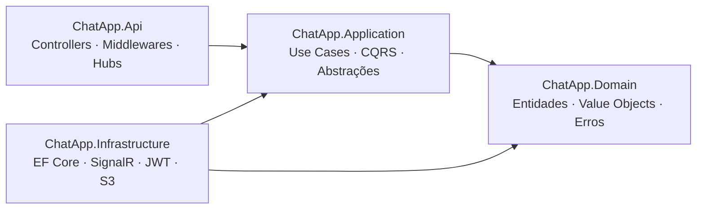

<div align="center">
  <h1>💬 ChatApp</h1>
  <p>API de chat em tempo real construída com .NET 10 e Clean Architecture</p>

  [](https://github.com/eovinicius/ChatApp/actions/workflows/ci.yml)
  
  
  
</div>

---

ChatApp é uma API REST + WebSocket de chat em tempo real construída com .NET 10 e Clean Architecture, demonstrando CQRS, Result Pattern, domain-driven design e integração com AWS S3.

## ✨ Funcionalidades

- 🔐 **Autenticação JWT** — registro e login com tokens de curta duração
- 🏠 **Salas de chat** — crie salas públicas ou protegidas por senha (máximo 50 membros)
- 💬 **Mensagens** — envie, edite (até 1h) e delete (até 24h) mensagens de texto
- 📎 **Upload de mídia** — imagens, áudio e vídeo via AWS S3 (máximo 50 MB)
- ⚡ **Tempo real** — notificações instantâneas via SignalR WebSocket
- 🚦 **Rate limiting** — proteção contra abuso por IP e por usuário

## 🛠 Stack

| Tecnologia | Uso |
|------------|-----|
| .NET 10 / ASP.NET Core | Framework web |
| PostgreSQL | Banco de dados relacional |
| Entity Framework Core | ORM + migrações |
| MediatR | CQRS e pipeline behaviors |
| SignalR | WebSocket em tempo real |
| JWT Bearer | Autenticação |
| AWS S3 | Armazenamento de mídia |
| xUnit + NSubstitute + FluentAssertions | Testes unitários e de integração |
| Serilog | Logging estruturado com correlation ID |

## 🏛 Arquitetura

ChatApp segue o padrão **Clean Architecture** com quatro camadas. As dependências sempre apontam para o centro: `API → Application → Domain` (Infrastructure implementa interfaces de Application).



> Veja [docs/architecture.md](docs/architecture.md) para detalhes sobre padrões e fluxo de dados.

## 🚀 Quickstart

**Pré-requisitos:** [.NET 10 SDK](https://dotnet.microsoft.com/download/dotnet/10.0) · [Docker Desktop](https://www.docker.com/products/docker-desktop/)

```bash
# 1. Clone o repositório
git clone https://github.com/eovinicius/ChatApp.git
cd ChatApp

# 2. Suba o banco de dados
docker-compose up -d --build chatapp-db

# 3. Configure as variáveis (veja docs/configuration.md)
dotnet user-secrets set "ConnectionStrings:Database" \
  "Host=localhost;Port=5432;Database=chatapp;Username=postgres;Password=postgres" \
  --project .\src\ChatApp.Api\
dotnet user-secrets set "JwtSettings:SecretKey" "dev-secret-key-min-32-characters" --project .\src\ChatApp.Api\
dotnet user-secrets set "JwtSettings:Issuer" "ChatApp" --project .\src\ChatApp.Api\
dotnet user-secrets set "JwtSettings:Audience" "ChatApp" --project .\src\ChatApp.Api\

# 4. Execute as migrações
dotnet ef database update --project .\src\ChatApp.Infrastructure\ --startup-project .\src\ChatApp.Api\

# 5. Rode a API
dotnet run --project .\src\ChatApp.Api\ChatApp.Api.csproj
```

Acesse a interface Swagger em **http://localhost:5110/swagger/index.html**

## 📖 Documentação

| Documento | Descrição |
|-----------|-----------|
| [Arquitetura](docs/architecture.md) | Camadas, padrões (Result, CQRS, IUserContext) e fluxo de dados |
| [Referência da API](docs/api.md) | Endpoints REST, autenticação, rate limiting, SignalR |
| [Banco de Dados](docs/database.md) | Modelo entidade-relacionamento e schema PostgreSQL |
| [Configuração](docs/configuration.md) | Settings, variáveis de ambiente e gerenciamento de segredos |
| [Desenvolvimento](docs/development.md) | Setup local, comandos, testes e convenções de código |

## 🧪 Testes

```bash
# Todos os testes
dotnet test

# Filtrar por classe
dotnet test --filter "FullyQualifiedName~CreateRoomTests"

# Apenas unit tests
dotnet test test/ChatApp.UnitTests/

# Apenas integration tests
dotnet test test/ChatApp.IntegrationTests/
```

## 📄 Licença

Distribuído sob a licença MIT. Veja [LICENSE](LICENSE) para detalhes.
