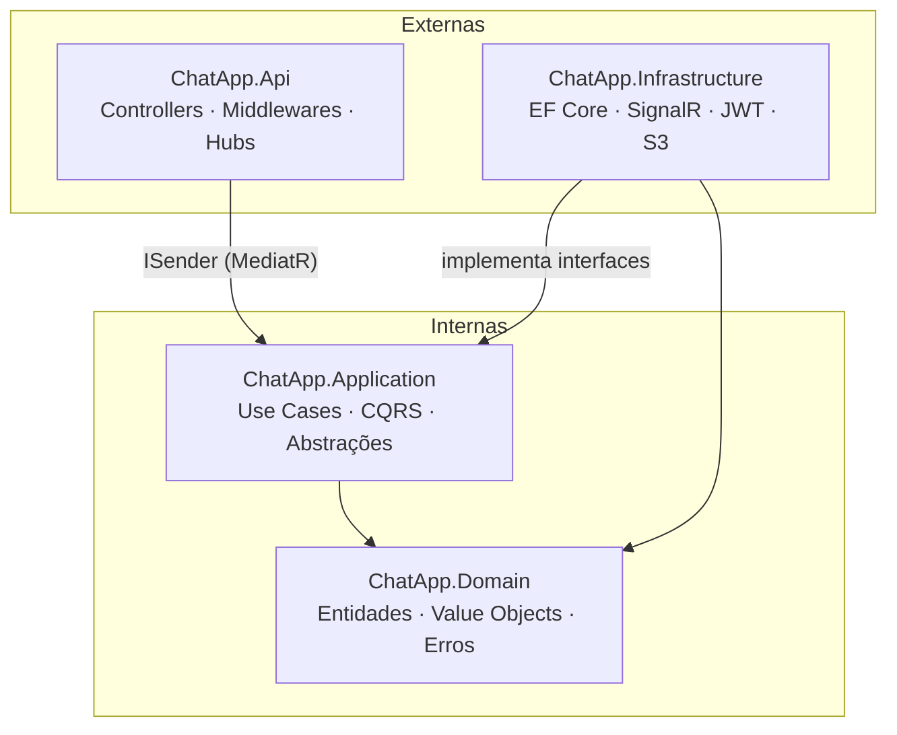
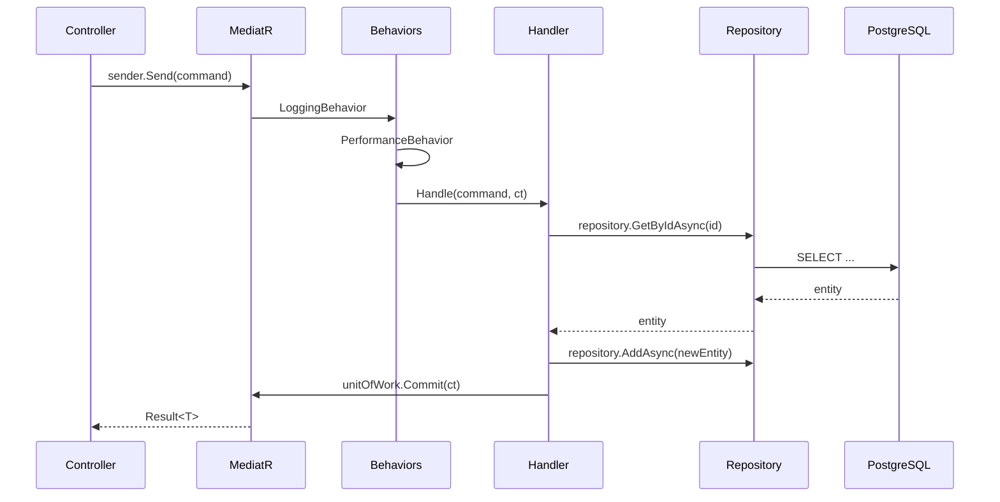
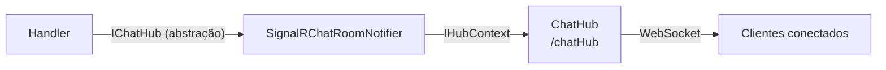

# Arquitetura

## Visão Geral

ChatApp segue o padrão **Clean Architecture**, separando o sistema em quatro camadas com dependências que sempre apontam para o centro. Nenhuma camada interna conhece detalhes das camadas externas.



## Camadas

| Camada | Projeto | Responsabilidade |
|--------|---------|-----------------|
| **Domain** | `ChatApp.Domain` | Entidades, value objects, interfaces de repositórios. Sem dependências de framework. |
| **Application** | `ChatApp.Application` | Use cases via CQRS (MediatR). Define abstrações (`IUserRepository`, `IChatHub`, etc.) que Infrastructure implementa. |
| **Infrastructure** | `ChatApp.Infrastructure` | EF Core + PostgreSQL, SignalR, JWT, AWS S3. Implementações concretas das abstrações de Application. |
| **API** | `ChatApp.Api` | Controllers, middlewares, configuração. Despacha comandos/queries via `ISender`. |

## Fluxo de uma Request HTTP



## Padrões Fundamentais

### Result Pattern

Todos os handlers retornam `Result` ou `Result<T>`. Erros de negócio nunca lançam exceções — são representados como `Error` records com `Code` e `Name`.

```csharp
// No handler
var room = await _roomRepository.GetByIdAsync(command.RoomId, ct);
if (room is null)
    return Result.Failure<Guid>(ChatRoomErrors.NotFound);

// No controller
var result = await _sender.Send(command);
if (result.IsFailure)
    return BadRequest(result.Error);
return Ok(result.Value);
```

### CQRS via MediatR

Commands alteram estado; queries apenas lêem. Cada use case tem seu próprio handler em `UseCases/{Feature}/{UseCase}/`.

```
UseCases/
├── Rooms/
│   ├── CreateRoom/
│   │   ├── CreateRoomCommand.cs         ← ICommand<Guid>
│   │   └── CreateRoomCommandHandler.cs  ← ICommandHandler<CreateRoomCommand, Guid>
│   └── JoinRoom/
│       ├── JoinRoomCommand.cs
│       └── JoinRoomCommandHandler.cs
└── Messages/
    └── GetMessagesByRoom/
        ├── GetMessagesByRoomQuery.cs         ← IQuery<IReadOnlyList<...>>
        └── GetMessagesByRoomQueryHandler.cs
```

O pipeline MediatR executa `LoggingBehavior` e `PerformanceBehavior` em toda request, transparentemente.

### IUserContext

Injeta o `UserId` do usuário autenticado nos handlers sem acessar JWT claims diretamente.

```csharp
internal sealed class SendMessageCommandHandler : ICommandHandler<SendMessageCommand, Guid>
{
    private readonly Guid _userId;

    public SendMessageCommandHandler(IUserContext userContext, ...)
    {
        _userId = userContext.UserId;
    }
}
```

### IUnitOfWork

Todo write handler deve chamar `Commit` ao final para persistir as mudanças na mesma transação.

```csharp
await _messageRepository.AddAsync(message, cancellationToken);
await _unitOfWork.Commit(cancellationToken); // obrigatório
```

### Entidades de Domínio

Construtores privados, instanciação via factory methods `Create()`. Mutações que podem falhar retornam `Result`.

```csharp
// Criação via factory
var room = ChatRoom.Create(name, isPrivate, password, ownerId, createdAt);
if (room.IsFailure)
    return Result.Failure<Guid>(room.Error);

// Mutação que pode falhar
var editResult = message.Edit(newContent, utcNow);
if (editResult.IsFailure)
    return Result.Failure(editResult.Error);
```

## Real-Time (SignalR)

`IChatHub` é a abstração definida em Application (sem dependência de SignalR). `SignalRChatRoomNotifier` é a implementação concreta em Infrastructure. Os handlers de command chamam apenas a interface.



Grupos SignalR seguem a convenção `chat_{roomId}`.
