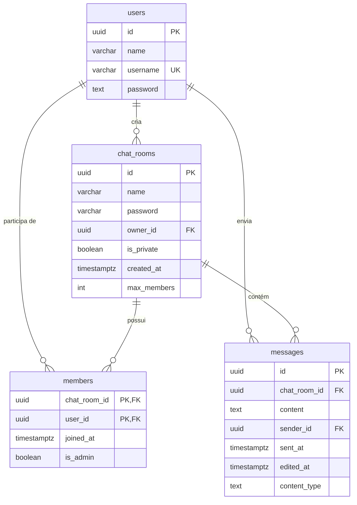

# Banco de Dados

## Modelo Entidade-Relacionamento

## Tabelas

### `users`

| Coluna | Tipo | Constraints | Descrição |
|--------|------|-------------|-----------|
| `id` | `uuid` | PK | Identificador único |
| `name` | `varchar(100)` | NOT NULL | Nome de exibição |
| `username` | `varchar(200)` | NOT NULL, UNIQUE | Nome de login |
| `password` | `text` | NOT NULL | Hash BCrypt da senha |

---

### `chat_rooms`

| Coluna | Tipo | Constraints | Descrição |
|--------|------|-------------|-----------|
| `id` | `uuid` | PK | Identificador único |
| `name` | `varchar(50)` | NOT NULL | Nome da sala |
| `password` | `varchar(30)` | — | Hash da senha (vazio se sala pública) |
| `owner_id` | `uuid` | NOT NULL | ID do usuário criador |
| `is_private` | `boolean` | NOT NULL | Se a sala requer senha para entrar |
| `created_at` | `timestamptz` | NOT NULL | Data de criação (UTC) |
| `max_members` | `int` | NOT NULL | Capacidade máxima (fixo em 50) |

---

### `members`

Tabela de junção entre `users` e `chat_rooms` — registra quem pertence a qual sala.

| Coluna | Tipo | Constraints | Descrição |
|--------|------|-------------|-----------|
| `chat_room_id` | `uuid` | PK, FK → `chat_rooms.id` | ID da sala |
| `user_id` | `uuid` | PK, FK → `users.id` | ID do usuário |
| `joined_at` | `timestamptz` | NOT NULL | Data de entrada na sala (UTC) |
| `is_admin` | `boolean` | NOT NULL | Se o usuário é administrador da sala |

**Cascade delete:** Ao deletar um `chat_room` ou um `user`, todos os registros de `members` correspondentes são excluídos automaticamente.

---

### `messages`

| Coluna | Tipo | Constraints | Descrição |
|--------|------|-------------|-----------|
| `id` | `uuid` | PK | Identificador único |
| `chat_room_id` | `uuid` | FK → `chat_rooms.id` | Sala onde a mensagem foi enviada |
| `content` | `text` | NOT NULL | Conteúdo textual ou URL do arquivo S3 |
| `sender_id` | `uuid` | FK → `users.id` | Autor da mensagem |
| `sent_at` | `timestamptz` | NOT NULL | Data de envio (UTC) |
| `edited_at` | `timestamptz` | — | Data da última edição (`null` se não editada) |
| `content_type` | `text` | NOT NULL | `text`, `image`, `audio` ou `video` |

## Índices

| Índice | Tabela | Coluna(s) | Tipo | Motivo |
|--------|--------|-----------|------|--------|
| `ix_users_username` | `users` | `username` | UNIQUE | Busca de login e garantia de unicidade |
| `ix_messages_chat_room_id` | `messages` | `chat_room_id` | Normal | Filtragem de mensagens por sala |
| `ix_messages_sent_at` | `messages` | `sent_at` | Normal | Paginação por cursor de data (query `before`) |

## Migrações

As migrações são gerenciadas pelo Entity Framework Core e ficam em `src/ChatApp.Infrastructure/Migrations/`. Em ambiente `Development`, são aplicadas automaticamente na inicialização da API via `app.ApplyMigrations()` em `Program.cs`.
